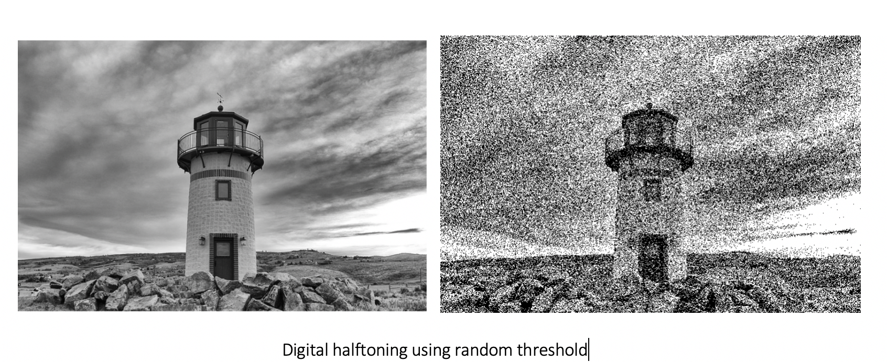

# Edge-Detection-and-Digital-Halftoning

In this repository I implement Edge Detection Techniques : Sobel Edge Detector, Canny Edge Detector and Structured Edge Detector, and Digital halftoning methods and compare their performance. Half-toning is a method for creating the illusion of continuous tone output with a binary device. The three ways of generating Digital Halftoning Images are Patterning, Dithering and Error Diffusion.

## Sobel Edge Detector:
Edge detection is an important procedure in image segmentation and processing. It is a technique to find the boundaries within an image. Edges are significant local changes of intensity in an image. The pixels at which there are discontinuities in the brightness can be treated as edge points. The study of edges is rather important because they contain information regarding the shape of an image and can be used for higher level computer vision algorithms (example: object recognition, segmentation).

<!-- <em>Original Image</em> -->
<!--  -->

<!-- <em>X gradient of the Image</em> -->
<!--  -->

<!-- <em>Y gradient of the Image</em> -->
<!--  -->

## Digital half-toning:

Digital half-toning is an important application in image processing. Printing process with the use of unique ink for almost an infinite range of colors and gray scale values isn’t a viable option and thus, digital half-toning is vital. The idea behind this technique is that the image is converted to discrete dots rather than continuous tones. The dots vary in size or spacing creating a gradient like effect to the human eye. The humans see the halftoned image as a continuous tone because they perceive the density of dots(which is governed by dots per inch (dpi)) rather than the individual dots. By using this method, the amount of unique shades of ink needed reduces drastically and this is why it is very popular in printing newspapers, magazines etc. This method can be extended to color images by repeating the halftone process for each subtractive color i.e., Cyan (C), Magenta (M), Yellow (Y), Black (K) color space.

### Sample results:

                                                      

