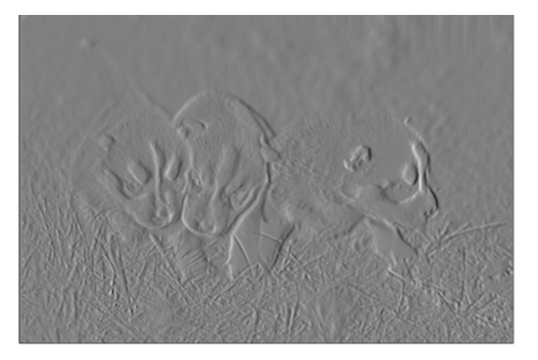

# Edge-Detection-and-Digital-Halftoning

In this repository I implement Edge Detection Techniques : Sobel Edge Detector, Canny Edge Detector and Structured Edge Detector, and Digital halftoning methods and compare their performance. Half-toning is a method for creating the illusion of continuous tone output with a binary device. The three ways of generating Digital Halftoning Images are Patterning, Dithering and Error Diffusion.

## Sobel Edge Detector:

<em>Original Image</em>

